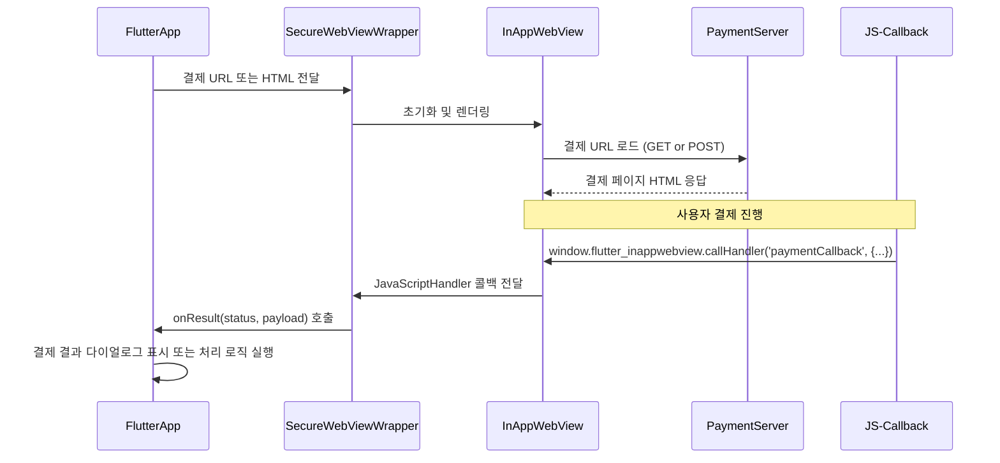

```mermaid

sequenceDiagram
  participant FlutterApp
  participant SecureWebViewWrapper
  participant InAppWebView
  participant PaymentServer
  participant JS-Callback

  FlutterApp->>SecureWebViewWrapper: 결제 URL 또는 HTML 전달
  SecureWebViewWrapper->>InAppWebView: 초기화 및 렌더링
  InAppWebView->>PaymentServer: 결제 URL 로드 (GET or POST)
  PaymentServer-->>InAppWebView: 결제 페이지 HTML 응답

  Note over InAppWebView,JS-Callback: 사용자 결제 진행

  JS-Callback->>InAppWebView: window.flutter_inappwebview.callHandler('paymentCallback', {...})
  InAppWebView->>SecureWebViewWrapper: JavaScriptHandler 콜백 전달
  SecureWebViewWrapper->>FlutterApp: onResult(status, payload) 호출
  FlutterApp->>FlutterApp: 결제 결과 다이얼로그 표시 또는 처리 로직 실행
```
