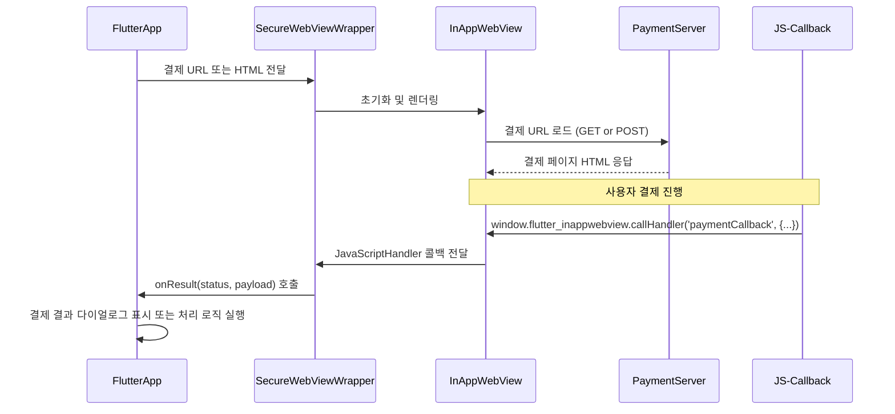

<br>
```mermaid
flowchart TD
    A[FlutterApp 시작] --> B{결제 방식}
    B -- "URL 기반" --> C[결제 URL 전달]
    B -- "HTML 직접 렌더링" --> D[결제 HTML 전달]

    C --> E[WebView 초기화]
    D --> E

    E --> F[토큰/쿠키 삽입<br>(PaymentSessionManager)]
    F --> G[InAppWebView 로딩 시작]

    G --> H{네트워크 요청}
    H -->|HTTPS 요청| I[결제 서버]
    I --> J[결제 페이지 HTML 응답]

    J --> K[사용자 결제 진행]
    K --> L{결제 결과}
    L -- 성공 --> M[JS → Flutter 콜백(paymentCallback)]
    L -- 실패 --> M

    M --> N[onResult()로 전달]
    N --> O{결과 처리}
    O -->|성공| P[거래 완료 UI / 서버에 영수증 전송]
    O -->|실패| Q[실패 안내 UI / 재시도 유도]
```
